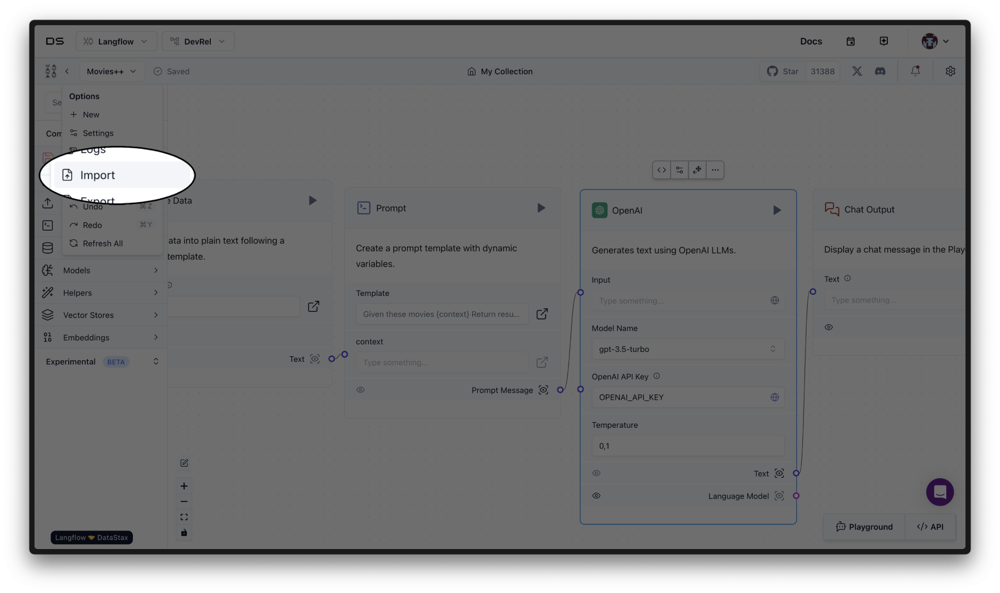

# Movies++

https://github.com/datastax/movies_plus_plus/assets/9947422/6e739836-dc25-4834-a5aa-e341a35d1559

Movies++ is a movie recommendation application that makes use of [GenAI](https://en.wikipedia.org/wiki/Generative_artificial_intelligence) to recommend movies based on natural language input. It is built on [DataStax Langflow](https://langflow.datastax.com/) and was demoed at [CascadiaJS](https://www.youtube.com/live/HfsNGyDQtJ4?si=XzDN5lzEcmIXncJ7&t=30203) and [DataStax's RAG++ AI Hack Night](https://www.datastax.com/events/rag-plus-plus-ai-hack-night-june-2024).

## Getting Started

To get started with this project and run it locally, follow the steps below:

1. Clone the repository
2. Change directory (`cd`) into the cloned repository
3. Install dependencies with `pnpm install`
4. Rename `.env.example` to `.env` and fill in the required environment variables
   - To fill this in, you'll need the following accounts:
     - [DataStax Astra](https://astra.datastax.com/)
     - [DataStax Langflow](https://langflow.datastax.com/)
     - [OpenAI](https://platform.openai.com/)
     - [TMDB](https://www.themoviedb.org/) (Optional, just for trailers)
5. Finally, run the project with `pnpm run dev`

From here, you'll be able to run the project locally, develop against it, add features, or whatever you'd like.

## Ingesting the Data

Once you've populated `.env` with your API keys, make sure you have a collection in your Astra database named "movies". Once all those pieces are in place, you can run the following command to ingest the data:

```bash
# Navigate to our scripts
cd ./scripts

# Install dependencies
pip install -r requirements.txt

# Run the script
python load_movies.py
```

When this script runs, it will ingest the data from TMDB into your Astra database. This will allow you to search for movies and get recommendations based on the data you've ingested.

## Working with Langflow

This repo comes with a `langflow.config` file. Create a project in [DataStax Langflow](https://langflow.datastax.com), and then import it from the Langflow UI.



From there, fill in any API keys required for OpenAI and such, and you should be able to run the flow. Finally, be sure to change the Langflow API endpoint to point to your instance in the [`Ai.tsx`](./app/Ai.tsx#L55) file.

## Contributing

We accept pull requests and issues on this project. If you've got ideas, please **open an issue first** and discuss it with us and ideally it becomes a pull request that we open together. All contributions are welcome!

### Contribution Ideas

If you'd like to contribute but don't know where to start, feel free to check out the [open issues](https://github.com/datastax/movies_plus_plus/issues) on this repository.
